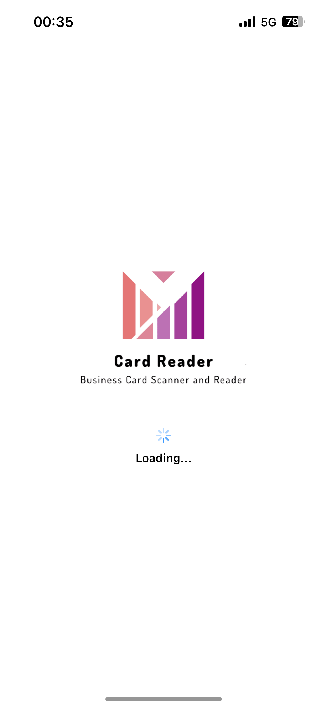
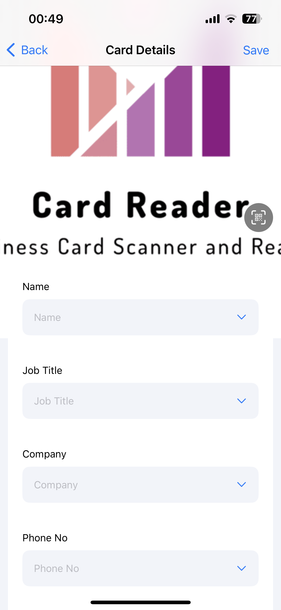
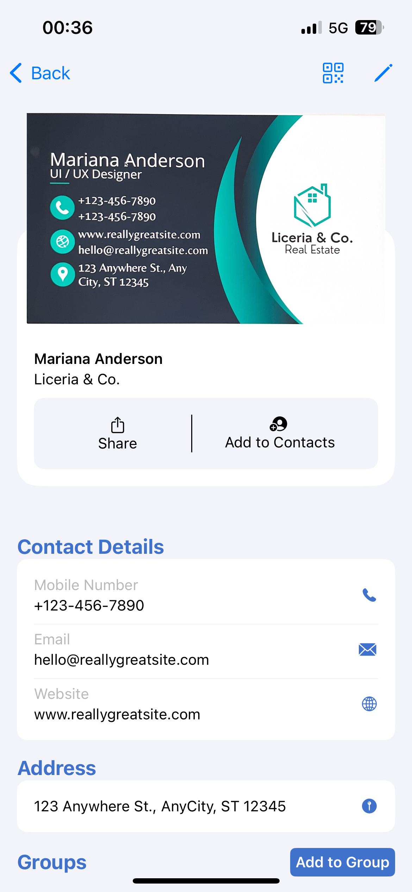

# SaDeBusinessCardScanner
An iOS app that can scan, store, and share business cards

## Features:
- Scan & Store visting cards using **CoreData**
- Recognise text from card & parse into Contacts using **VisionKit**
- Image compression to save storage by converting to binary data
- Generate **vCard QR code** from saved contacts
- Backup all your data on **iCloud** using **CloudKit**
- **Google AdMob** Integration
- Add to contacts 
- Tagging into groups

    
    
    
    

https://github.com/user-attachments/assets/91f12b21-a9bf-4aa5-9e4c-c4ec68f5fbbd

